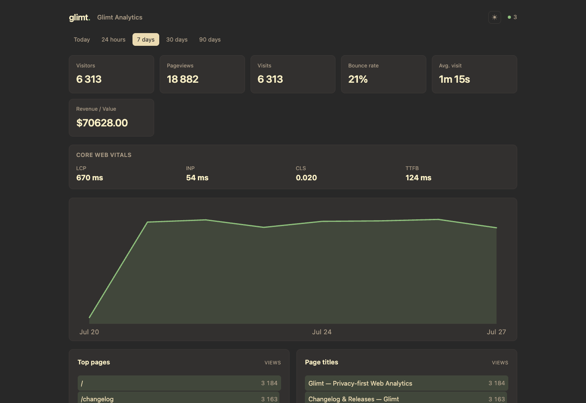

# glimt

Self-hosted, privacy-first web analytics in a single static Go binary + one
SQLite file. Cookieless, no raw IP stored, and served first-party so ad-block
lists can't match it.



- **Cookieless & Privacy-First** — daily-rotating `hash(salt + site + ip + ua)`; IP used only in-memory at ingest, never stored. No cookies, no localStorage, GDPR-compliant by design.
- **Unblockable Architecture** — tracking script and collector live at randomized paths (`/s/<token>.js`, `/e/<token>`); ~640-byte snippet, no recognizable names, posts via `fetch`. Can be served first-party on tracked domains to completely bypass ad-blockers.
- **Lightweight Engine** — pure-Go SQLite (no cgo), WAL mode, batched writes, and automated rollup tables.
- **Core Web Vitals & Conversion Funnels** — automatically tracks LCP, INP, CLS, TTFB, and supports multi-step conversion funnel analysis.
- **Data Export & Public Links** — export raw event logs to CSV or JSON; generate public read-only share links for your dashboard.
- **No-JS / Pixel Fallback** — 1x1 GIF tracking pixel for email open rates or non-JavaScript client environments.
- **Gruvbox Themes** — clean, fast dashboard (HTMX + inline-SVG) with built-in dark and light modes.

## Run with Docker

```yaml
# docker-compose.yml
services:
  glimt:
    image: ghcr.io/klppl/glimt:latest
    restart: unless-stopped
    ports: ["8080:8080"]
    environment:
      GLIMT_ADMIN_USER: admin
      GLIMT_ADMIN_PASS: change-me            # creates the admin on first boot
      GLIMT_BASE_URL: https://stats.example.com
    volumes:
      - glimt-data:/data                     # holds /data/glimt.db
volumes:
  glimt-data:
```

```bash
docker compose up -d
```

Open the dashboard, sign in, add a site, and paste its snippet into your `<head>`:

```html
<script defer src="https://stats.example.com/s/<token>.js"></script>
```

Custom events (global name configurable via `GLIMT_JS_GLOBAL`):

```js
glimt('signup', { plan: 'pro' });
```

> The image is `linux/amd64`. If the GHCR package is private, either make it
> public (repo → Packages → settings) or `docker login ghcr.io` on the host.

## Configuration

Env vars (prefixed `GLIMT_`) override an optional `GLIMT_CONFIG` JSON file.

| Var | Default | Description |
|---|---|---|
| `GLIMT_ADDR` | `:8080` | Listen address. |
| `GLIMT_DB` | `glimt.db` | SQLite path (use `/data/glimt.db` in Docker). |
| `GLIMT_ADMIN_USER` / `_PASS` | — | Admin credentials, created on first boot. |
| `GLIMT_BASE_URL` | — | Public URL; enables `Secure` cookies + absolute links. |
| `GLIMT_GEO_DB` | — | DB-IP or GeoLite2 `.mmdb` for country reports. |
| `GLIMT_REAL_IP_HEADER` | `X-Forwarded-For` | Header carrying the real client IP. |
| `GLIMT_TRUSTED_PROXIES` | — | CIDRs / `cloudflare` / `private` allowed to set that header. |
| `GLIMT_CF_COUNTRY` | `false` | Use Cloudflare `CF-IPCountry` for geo (no DB needed). |
| `GLIMT_JS_GLOBAL` | `glimt` | Custom-event global name. |
| `GLIMT_SESSION_TTL_HOURS` | `168` | Admin login session lifetime in hours. |

## Behind a reverse proxy

glimt must be reached on **your own domain** (first-party). Forward the client
IP and only trust that header from your proxy.

**Cloudflare:**

```bash
GLIMT_REAL_IP_HEADER=CF-Connecting-IP
GLIMT_TRUSTED_PROXIES=cloudflare,private   # drop ,private if CF hits glimt directly
GLIMT_CF_COUNTRY=true
```

`cloudflare` = CF edge ranges; add `private` when a local proxy (npmplus/nginx)
sits in between. Without `GLIMT_TRUSTED_PROXIES`, the IP header is trusted
unconditionally (fine for dev, not for production).

## Truly unblockable: serve glimt first-party

Loading the script from a **separate** host (e.g. `glimt.example.com` on a site
at `example.com`) makes every request *third-party*. Ad-blockers don't need to
recognize glimt by name — uBlock Origin's default lists already drop third-party
beacons (`*$ping,3p`) and can target third-party requests generically. The
snippet uses `fetch` instead of `sendBeacon` to dodge the `ping` rule, but the
only way to be genuinely unmatchable is to serve the script and endpoint **from
the tracked domain itself**, so they're first-party.

Proxy a single non-obvious prefix on the tracked site to glimt, keeping the
`/s/` and `/e/` sub-paths intact — the snippet locates its own endpoint relative
to its `<script src>`, so it auto-posts back through the same first-party prefix.

**nginx (on `example.com`):**

```nginx
location /_a/s/ {                       # the script
    proxy_pass https://glimt.example.com/s/;
    proxy_set_header Host glimt.example.com;
}
location /_a/e/ {                       # the collector
    proxy_pass https://glimt.example.com/e/;
    proxy_set_header Host glimt.example.com;
    proxy_set_header X-Forwarded-For $remote_addr;
}
```

**Cloudflare** (tracked site on Cloudflare): add a Worker/Origin Rule on
`example.com` forwarding `/_a/s/*` → `glimt.example.com/s/*` and `/_a/e/*` →
`glimt.example.com/e/*`.

Install the **first-party** path on the page:

```html
<script defer src="/_a/s/<script_token>.js"></script>
```

The script derives its endpoint as `/_a/e/<collect_token>` from its own URL —
same origin, no `3p`, no CORS, nothing for a filter list to match. (If
`document.currentScript` is unavailable, it falls back to the absolute endpoint
baked from `GLIMT_BASE_URL`.)

## Core Web Vitals & Conversion Funnels

- **Web Vitals**: Glimt automatically captures LCP, INP, CLS, and TTFB from supporting browsers and displays aggregate vitals in the top dashboard bar.
- **Conversion Funnels**: Define custom multi-step funnels (e.g. `/` → `/pricing` → `signup`) directly from the dashboard to analyze step-by-step conversion rates and drop-off percentages.

## No-JS & Email Open Tracking

For environments without JavaScript execution or for tracking email opens, Glimt provides a 1x1 transparent GIF pixel endpoint:

```html
.gif" alt="" width="1" height="1" />
```

Query parameters `u` (URL), `t` (Page Title), and `n` (Event Name) can also be appended to customize pixel events.

## GeoIP

Country/region resolves in-memory from a local `.mmdb` (DB-IP Lite needs no
account; GeoLite2 also works), or skip it entirely with `GLIMT_CF_COUNTRY=true`.

## Build from source

```bash
CGO_ENABLED=0 go build -trimpath -ldflags="-s -w" -o glimt ./cmd/glimt
```

## Privacy

No cookies, no localStorage, no persistent IDs, no raw IP, no cross-day
linkability, no fingerprinting. GDPR-friendly by construction.
